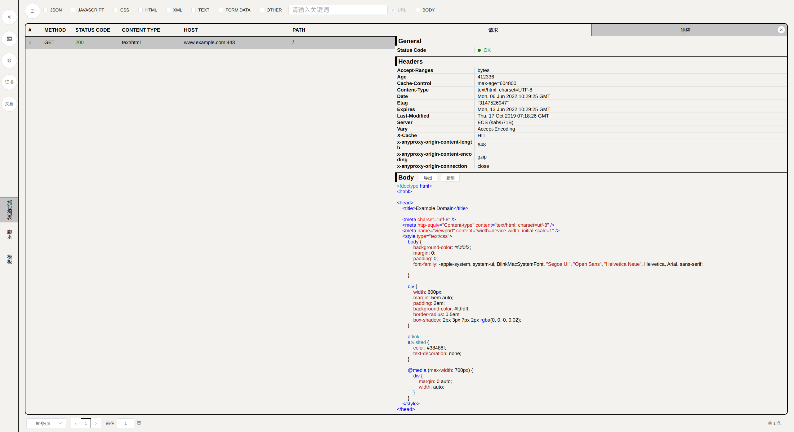
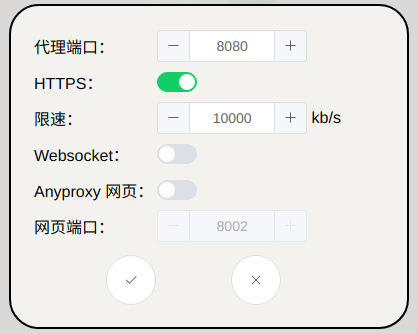

# eanyproxy

eanyproxy 是一个支持 HOOK 的 HTTP/HTTPS 代理程序

# 对用户的要求

本软件要求用户需要对 [HTTP](https://baike.baidu.com/item/HTTP/243074?fr=aladdin) 有基本了解，如果要自行编写 HOOK 脚本，用户还应该熟练的掌握 [JavaScript](https://www.runoob.com/js/js-tutorial.html) 和 [nodejs](https://www.runoob.com/nodejs/nodejs-tutorial.html)

# 功能介绍

**上方面板**

**删除：**清理列表中的所有请求

**JSON、JAVASCRIPT、......、OTHER：**这些选项用于对响应体进行过滤，比如勾选 JSON，那么页面上将只会展示响应体为 JSON 的请求，这些选项支持多选，也可以不选，不选表示不进行刷选

**关键词输入框：**输入关键词以对请求进行过滤

**URL、BODY：**指定用关键词去匹配请求哪一个部分，URL: 用关键字匹配 URL，BODY：用关键词匹配请求体或响应体

**左侧控制面板**

首先请看这四个按钮，依次是：**运行/停止**、**控制台**、**设置**、**证书**

**运行/停止**：运行或者停止 HTTP 代理服务

**控制台**：代开一个控制台窗口，展示程序的日志信息，HOOK 脚本中通过 console.info()、console.log() 函数打印的语句也会被输出到控制台

**设置**：设置代理服务的参数，详细介绍请查看[代理服务设置](#代理服务设置)小节

**证书**：生成并查看 HTTPS 证书，请注意，证书不可删除，证书名称不可修改，否则会导致代理服务无法启动

**抓包列表**：程序收到的 HTTP 代理请求列表

**脚本**：HOOK 脚本，用于对数据执行特定的操作，比如将收到的代理请求的数据，输出到 excel

**模板**：HOOK 脚本模板，用于快速创建 HOOK 脚本

## 代理服务设置

**代理端口**：HTTP 代理服务的端口

**HTTPS**：是否启用 HTTPS 代理

**Websocket**：是否启用 HTTP Websocket 代理

**Anyproxy**：是否启用 Anyproxy 网页，启用该选项之后，可以通过浏览器访问 `http://localhost:8002`

**网页端口**：Anyproxy 网页的端口号，默认是 8002

代理服务设置修改后，需要重启代理服务，才可以应用设置

# HOOK 脚本基础以及样例

[HOOK 脚本基础](./hook-base.md)

[修改请求和响应](./modify-requests-and-responses.md)

[将请求数据输出为 excel 文件](./excel.md)
